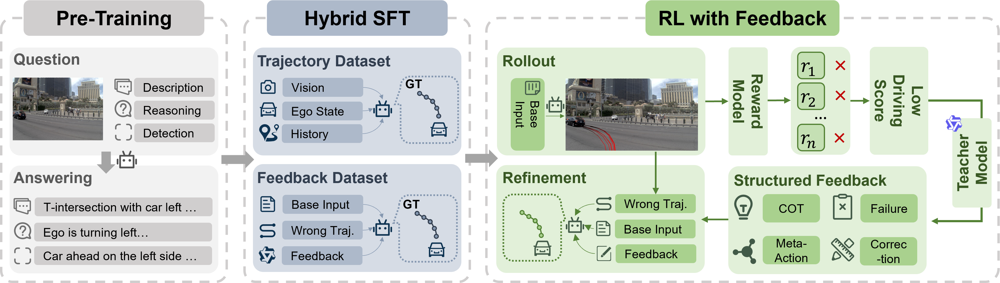

<div align="center">
<h3>[🎉CVPR 2026] Unleashing VLA Potentials in Autonomous Driving via Explicit Learning from Failures </h3>

Yuechen Luo<sup>1\*</sup>, Qimao Chen<sup>1\*</sup>, Fang Li<sup>2\*</sup>, Shaoqing Xu<sup>2‡</sup>, Jiaxin Liu<sup>1</sup>, Ziying Song<sup>3</sup>, Zhi-xin Yang<sup>3,✉</sup>, Fuxi Wen<sup>1,✉</sup>

<sup>1</sup> Tsinghua University, <sup>2</sup> University of Macau, <sup>3</sup> Beijing Jiaotong University

(\*) Equal contribution. (‡) Project leader. (✉) Corresponding author.

<a href="https://arxiv.org/"></a>
</div>

## Abstract

Vision-Language-Action (VLA) models for autonomous driving often hit a performance plateau during Reinforcement Learning (RL) optimization. This stagnation arises from exploration capabilities constrained by previous Supervised Fine-Tuning (SFT), leading to ``persistent failures" in long-tail scenarios. In these critical situations, all explored actions yield a zero-value driving score. This information-sparse reward signals a failure, yet fails to identify its root cause—whether it is due to incorrect planning, flawed reasoning, or poor trajectory execution. 
To address this limitation, we propose VLA with Explicit Learning from Failures (ELF-VLA), a framework that augments RL with structured diagnostic feedback. Instead of relying on a vague scalar reward, our method produces detailed, interpretable reports that identify the specific failure mode. The VLA policy then leverages this explicit feedback to generate a Feedback-Guided Refinement. By injecting these corrected, high-reward samples back into the RL training batch, our approach provides a targeted gradient, which enables the policy to solve critical scenarios that unguided exploration cannot. Extensive experiments demonstrate that our method unlocks the latent capabilities of VLA models, achieving state-of-the-art (SOTA) performance on the public Navsim benchmark for overall PDMS, EPDMS score and high-level planning accuracy.

## Overview
<div align="center">

</div>

## News

`[2026/02/21]` ELF-VLA is accepted by **CVPR 2026**🎉🎉🎉!

## Currently Supported Features

- [ ] ELF-VLA Inference Code
- [ ] ELF-VLA Checkpoint
- [ ] ELF-VLA Training Code
- [ ] Training Dataset


## Citation
If this work is helpful for your research, please consider citing:

```
@inproceedings{x,
  title={Unleashing VLA Potentials in Autonomous Driving via Explicit Learning from Failures},
  author={X},
  booktitle={X},
  year={2026}
}
```

